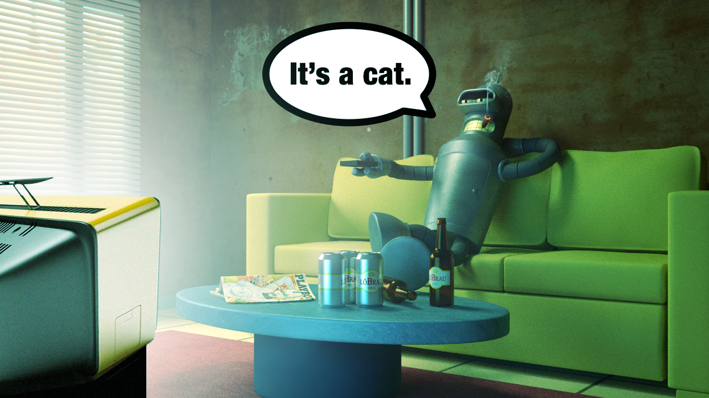
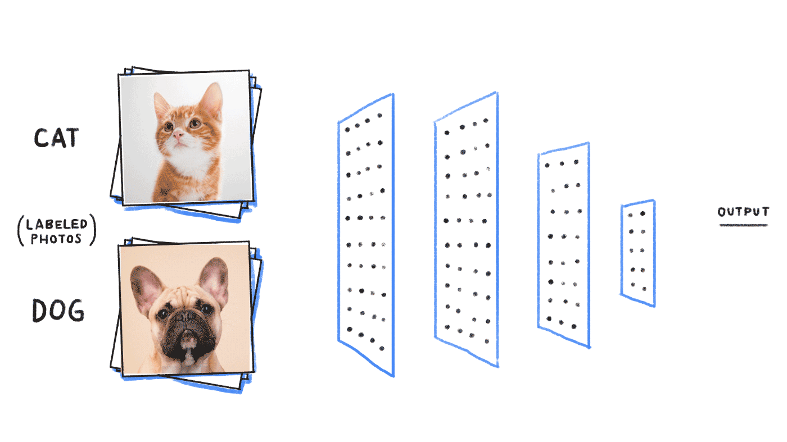

# Image Recognition with TensorFlow & Keras
<p align="center">

</p>

## Basics of a Neural Network
Usually we feed a computer instructions to compute data in a predetermined way, and the output is therefore a function of that algorithm programmed as such. A neural network is the exact opposite. If we imagine a black box for representing the neural network, that box would contain the following:

<p align="center">

</p>

The input layer is where the pre-identified training data comes in and "teach" the neural network. The output layer is where the neural network gathers instructions to predict new data and classify it into previously identified as accurately as possible. This accuracy is dependent upon the size of the training data (the more you teach a model with new data, the better it gets at predicting) and the configuration of the hidden layers. The hidden layers are responsible for extracting features from training data which are then collated and compiled into a model.

> One hidden layer means you just have a neural network. Two or more hidden layers? Boom, you've got a deep neural network! Multiple hidden layers allows the network to create non-linear relationships between the input and the output.

## Data Preparation
I'll be using one of the most prevalent datasets for image recognition - Cats vs Dogs. Since the size of the dataset (or the pickled version of it) is quite large, I'll include the link for where to get it:

- https://www.microsoft.com/en-us/download/details.aspx?id=54765&WT.mc_id=rss_alldownloads_devresources
- Resize images to have a common dimension
- Convert all images to greyscale or perform histogram equalization to retain color

<p align="center">

</p>

> All training images have certain features that are helpful in differentiating between the given categories, and in order to only use those differentiating features in the hidden layers, we need to get rid of the the non-feature data from these images (for example - color and image size are components of the data but do not determine whether the image is of a cat or a dog).

## Training the Model
We'll be trying out unique combinations of CNN structures, each having different:
- Convolutional layer
- Dense layer & 
- Layer size 

```python
dense_layers = [0, 1, 2]
layer_sizes = [32, 64, 128]
conv_layers = [1, 2, 3]

for dense_layer in dense_layers:
    for layer_size in layer_sizes:
        for conv_layer in conv_layers:
            
            # Training Convolutional Neural Networks according to layer configurations decided per loop.
```


During the training process, we need to monitor the loss and the model accuracy. Each of these combinations could take from a minute to several minutes (depending on the use CPU or GPU), we would want to log the outputs of each to use further for comparison. We would therefore be using the keras' tensorboard callback function when we compile and fit the model instance. 

<p align="center">

</p>

## TensorBoard logs

>Upon going through all CNN combinations, we see from the logs that the 3-conv-128-nodes-1-dense model has performed better than the rest.

Let's check out the vitals for the 3-conv-128-nodes-1-dense model

Epoch Accuracy/Loss             |  Epoch Validation Accuracy/Loss
:-------------------------:|:-------------------------:
  |  

```python
Model: "sequential"
_________________________________________________________________
Layer (type)                 Output Shape              Param #   
=================================================================
conv2d (Conv2D)              (None, 98, 98, 128)       1280      
_________________________________________________________________
activation (Activation)      (None, 98, 98, 128)       0         
_________________________________________________________________
max_pooling2d (MaxPooling2D) (None, 49, 49, 128)       0         
_________________________________________________________________
conv2d_1 (Conv2D)            (None, 47, 47, 128)       147584    
_________________________________________________________________
activation_1 (Activation)    (None, 47, 47, 128)       0         
_________________________________________________________________
max_pooling2d_1 (MaxPooling2 (None, 23, 23, 128)       0         
_________________________________________________________________
conv2d_2 (Conv2D)            (None, 21, 21, 128)       147584    
_________________________________________________________________
activation_2 (Activation)    (None, 21, 21, 128)       0         
_________________________________________________________________
max_pooling2d_2 (MaxPooling2 (None, 10, 10, 128)       0         
_________________________________________________________________
flatten (Flatten)            (None, 12800)             0         
_________________________________________________________________
dense (Dense)                (None, 128)               1638528   
_________________________________________________________________
activation_3 (Activation)    (None, 128)               0         
_________________________________________________________________
dense_1 (Dense)              (None, 1)                 129       
_________________________________________________________________
activation_4 (Activation)    (None, 1)                 0         
=================================================================
Total params: 1,935,105
Trainable params: 1,935,105
Non-trainable params: 0
_________________________________________________________________
---------------------------------------------------------------------------
```


## Test


## Save

